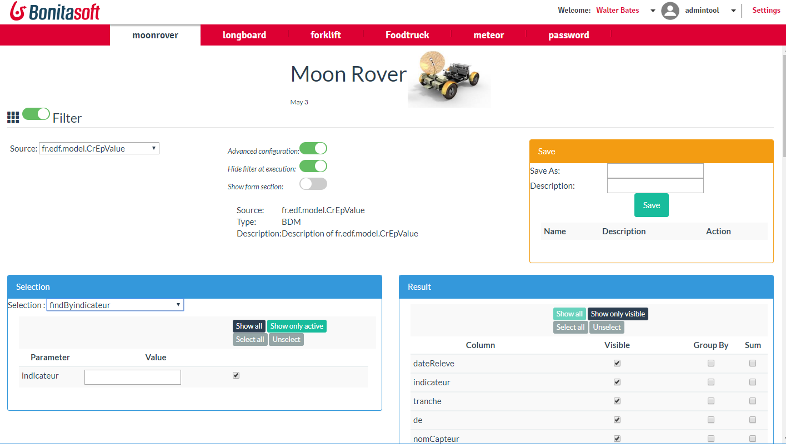
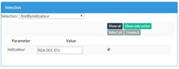
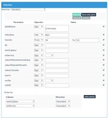
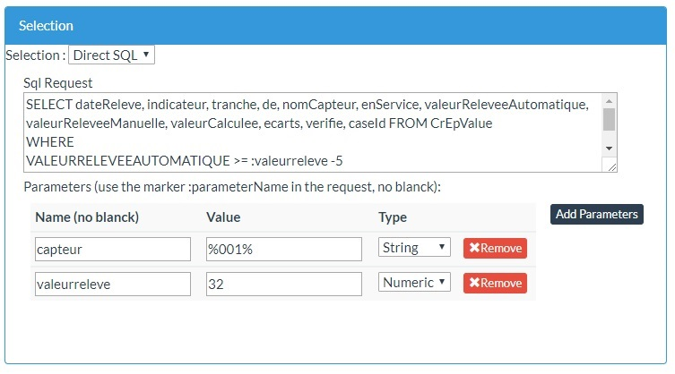
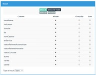
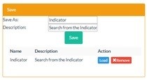
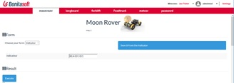

# page_moonrover
Report on BDM

  
Noon Rover is used to access the Business Data Model information. All data in theses tables can be search.
When to use it? 
In production, to search data in your database.
To build some form, and give access to your users

Search in your Business Data Table
As an administrator (you should have access to the profile Administrator), All different objects are visible in the list. Select one objet.
In the selection, the different queries are visible:
•	All Queries defined in the Business (custom and standard)
•	A Standard Request
•	A Direct SQL Request

Using Query
 
 	The Business Data Model defined standard query, and may define custom query. Query may have parameters.  The Selection panel look for the parameters, and ask them to the user.

Using Standard request
 
 	All attributes on the table are produced in the form. 
User can build a complex search, and can set up the order by criteria

Using Direct SQL
 
Via the DirectSL, it’s possible to buid a complex SQL request. You can use parameters in your request

Configure the result
 
Fields to display on the result is configurable. Some function, like the GroupBy and sum (available only in Standard request) are available.
Using a Standard Request allow to produce a Chart or a JASPER report as result. Another request allows you only to produce a Table.
	 

Run the request

Result is displayed according the type of result. A pagination is organized, and it’s possible (Standard Request) to order the column by clicking on the header.

Configure request for users
 

 	Administrator can save a request, to access it easy after

This request is then accessible to user who can access the page, but which are not an administrator. User gives values of parameters.	 

 
 
